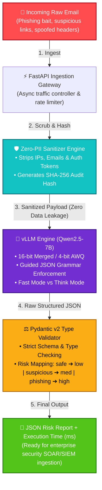

# 🛡️ Zero-PII Phishing Risk Scoring Platform

<p align="center">
  
</p>

<p align="center">
  <a href="https://huggingface.co/Ilieg/qwen2.5-7b-phishing-standard-merged-16bit">
    
  </a>
  <a href="./LICENSE">
    
  </a>
  
  
  
</p>

## Table of Contents

- [Overview](#overview)
- [Why This Project Exists](#why-this-project-exists)
- [Key Results](#key-results)
- [System Architecture](#system-architecture)
- [Core Features](#core-features)
- [Model Evaluation & Ablation Study](#model-evaluation--ablation-study)
- [Research & Design Commentary](#research--design-commentary)
- [Mathematical Foundations](#mathematical-foundations)
- [Reproducing Benchmarks](#reproducing-benchmarks)
- [Public vs Private Components](#public-vs-private-components)
- [Technologies](#technologies)
- [Skills Demonstrated](#skills-demonstrated)
- [Key Learnings](#key-learnings)
- [Internship & Collaboration](#internship--collaboration)
- [License](#license)

---

## Overview

**Zero-PII Phishing Risk Scoring Platform** is a privacy-preserving AI security system designed to analyse phishing threats while preventing sensitive information from ever reaching the inference layer.

The system combines:

- Artificial Intelligence
- Cybersecurity
- Privacy Engineering
- Backend Engineering

to produce structured phishing risk assessments that can integrate with enterprise security workflows (SIEM/SOAR).

---

## Why This Project Exists

Most phishing detection systems focus on detection accuracy alone. This project explores a different engineering question:

> How can AI systems identify phishing threats while minimising exposure of sensitive user information?

The resulting architecture implements, in order, before any security verdict is returned:

1. Zero-PII pre-processing
2. Structured AI outputs
3. Deterministic validation
4. High-throughput serving
5. Privacy-first logging

---

## Key Results

- Improved phishing classification accuracy from **82.40% → 97.80%**
- Increased phishing F1-score from **80.10% → 97.46%**
- Reduced serving memory requirements from **14.2 GB → 5.9 GB** via quantisation
- Maintained inference latency at approximately **255 ms**
- Achieved deterministic, schema-compliant JSON outputs for downstream integration

---

## System Architecture



---

## Core Features

**Zero-PII Processing**
- SHA-256 hashing of sensitive metadata
- Header sanitisation before inference
- Privacy-preserving audit logging

**Threat Classification**
- Fine-tuned Qwen2.5-7B model
- QLoRA-based adaptation
- Email phishing risk assessment
- Social engineering detection

**Production-Oriented Serving**
- FastAPI REST interface
- Containerised deployment
- vLLM inference engine
- CPU fallback strategy

**Reliability Controls**
- Pydantic v2 validation
- Structured JSON outputs
- Contract-first API design
- Input validation boundaries

---

## Model Evaluation & Ablation Study

| Architecture / Variant | Tuned Target Modules | Accuracy | Phishing F1 | ROC-AUC | Avg. Latency (256 tok) | VRAM Footprint |
|---|---|---|---|---|---|---|
| Qwen2.5-7B (Base, Zero-Shot) | None | 82.40% | 80.10% | 0.8310 | ~240 ms | 14.2 GB (16-bit) |
| Standard LoRA (Attention-Only) | `q, k, v, o` | 97.00% | 96.50% | 0.9681 | ~250 ms | 5.8 GB (4-bit AWQ) |
| **Comprehensive LoRA (Best)** | `q, k, v, o, gate, up, down` | **97.80%** | **97.46%** | **0.9773** | ~255 ms | 5.9 GB (4-bit AWQ) |

```text
========================================================================================
                      ROC-AUC SCORE COMPARISON (HIGHER IS BETTER)
========================================================================================

 Qwen2.5-7B (Base Zero-Shot)     ██████████████████████████████████████░░░░░░░  0.8310
 Standard LoRA (q, k, v, o)      █████████████████████████████████████████████  0.9681
 Comprehensive LoRA (All Layers) ██████████████████████████████████████████████ 0.9773 ★

========================================================================================
                      PHISHING F1-SCORE COMPARISON (HIGHER IS BETTER)
========================================================================================

 Qwen2.5-7B (Base Zero-Shot)     ████████████████████████████████████░░░░░░░░░  80.10%
 Standard LoRA (q, k, v, o)      █████████████████████████████████████████████  96.50%
 Comprehensive LoRA (All Layers) ██████████████████████████████████████████████ 97.46% ★
```

**Key finding:** Expanding LoRA training beyond attention layers into MLP projections (`gate_proj`, `up_proj`, `down_proj`) improved phishing F1 performance while introducing minimal latency overhead — the model learns multi-hop semantic reasoning (e.g. urgency manipulation, brand impersonation) rather than just surface-level keywords.

---

## Research & Design Commentary

**Architectural shift: resilient infrastructure over wrappers.** The industry consensus has shifted — we no longer reward LLM wrappers, we reward resilient LLM infrastructure. A common junior-engineer pattern is to boot up an expensive GPU, load a model, and throw raw user text at it, hoping `json.loads()` magically works on the other side. This system was designed **contract-first**: the API contract was locked down, an automated test harness was built, and the entry point was hardened against malicious input — all before touching a single model weight.

| Dimension | Naive ML Approach | This Project's Approach |
|---|---|---|
| Schema Validation | Hopes the model returns JSON; parses with raw `json.loads()`. | Enforces a strict Pydantic v2 schema coupled with vLLM Guided Decoding (`xgrammar` backend). |
| Failure Handling | Throws an unhandled HTTP 500 when the LLM hallucinates JSON syntax. | Fails fast at the boundary; prevents syntax hallucinations at the logits level. |
| DoS Defense | Accepts unbounded input strings directly into model context. | Enforces a strict input-length boundary at the API routing layer (fast-fail). |
| Observability | Logs raw text strings containing confidential emails and PII. | Hashes input payloads with SHA-256 for zero-PII, traceable logging. |

**Guided decoding.** LLMs are probabilistic text generators; even fine-tuned, they can hallucinate a missing comma or broken JSON bracket and crash a parser. vLLM's Guided Decoding passes a strict JSON schema directly into the model's sampling engine, masking output probabilities at the logits level — if the next token required for valid JSON is a quotation mark, its probability is forced to ~100%. Pydantic then validates the data *after* generation; Guided Decoding enforces the structure *during* generation.

**Data engineering.** Your model will always expose your data pipeline's flaws. Training data was drawn from respected public corpora (Enron, TREC 05/06/07, SpamAssassin, Nigerian Fraud, etc.), deduplicated with an O(1) SHA-256 cryptographic filter to guard against data/model poisoning (OWASP LLM04:2025), and standardized into ChatML format hard-mapped to the platform's output schema — teaching the model that anything other than the schema is incorrect. Bare-URL and tabular-feature datasets were intentionally rejected: the model is a natural-language email parser, not a URL or tabular classifier, and mixing in those formats causes catastrophic interference. The result: 3,999 deduplicated text-email records, split 80/10/10 into train/validation/test, with the test set locked away and never exposed during training.

**Classical baseline first.** Before fine-tuning a 7B-parameter LLM, a classical baseline (91.25% accuracy, 0.91 F1) was established to confirm the data contained learnable signal and to set a concrete floor the fine-tuned model had to beat.

**Compute-constrained fine-tuning.** Using **Unsloth** and **QLoRA**, the model is aligned on a single free 16 GB Colab T4 GPU, loaded in 4-bit NormalFloat (NF4) precision with gradient checkpointing (up to 60% VRAM reduction). LoRA adapters are injected into *all* linear layers, not just attention — this parameter depth is what lets the model remap its natural-language outputs into the strict JSON schema. Rank `r=16`, alpha `α=16` strikes the balance between learning phishing-specific nuance and avoiding catastrophic forgetting.

**High-throughput serving.** vLLM's **PagedAttention** eliminates KV-cache memory waste via non-contiguous virtual memory blocks, and **continuous batching** dynamically injects new requests at the iteration level, reducing time-to-first-token.

**Why Qwen 2.5 7B in a Qwen 3.x world?** 7B parameters sits in a "Goldilocks zone" — enough reasoning depth for psychological threat intelligence (urgency, implicit threats) and strict JSON adherence, while fitting cleanly inside a free Colab T4's 16 GB VRAM in 4-bit. Newer models frequently break production training frameworks; Qwen 2.5 7B is fully optimized by Unsloth and vLLM, prioritizing ecosystem stability and deterministic behavior over chasing the newest release.

---

## Mathematical Foundations

**Contextual understanding (Scaled Dot-Product Attention):**

$$\text{Attention}(Q,K,V) = \text{softmax}\left(\frac{QK^T}{\sqrt{d_k}}\right)V$$

**Efficient fine-tuning (LoRA):**

$$W = W_0 + \Delta W = W_0 + \frac{\alpha}{r}(B \cdot A)$$

**Learning objective (Cross-Entropy Loss):**

$$\mathcal{L}_{CE} = -\frac{1}{N}\sum_{i=1}^{N}\sum_{j=1}^{C} y_{i,j} \log(\hat{y}_{i,j})$$

**Measuring success (F1 Score):**

$$F_1 = 2 \cdot \frac{\text{Precision} \cdot \text{Recall}}{\text{Precision} + \text{Recall}}$$

---

## Reproducing Benchmarks

```bash
# Clone
git clone https://github.com/ilieg02/Zero-PII-Phishing-Engine-Architecture.git
cd Zero-PII-Phishing-Engine-Architecture

# Install dependencies
python3.10 -m venv .venv
source .venv/bin/activate
pip install -r requirements.txt

# Run the benchmark
python eval_benchmark.py
```

---

## Public vs Private Components

This repository documents the system's design, methodology, and results. The production application itself lives in a private implementation repository.

**Public (this repository)**
- ✅ Architecture documentation
- ✅ API contracts
- ✅ Evaluation framework
- ✅ Benchmarking methodology
- ✅ Design decisions

**Private**
- 🔒 Production API service
- 🔒 Deployment infrastructure
- 🔒 Internal security controls
- 🔒 Operational configurations
- 🔒 Testing environment

---

## Technologies

**AI & Machine Learning**
Qwen2.5-7B · QLoRA · PEFT · Hugging Face · Unsloth · vLLM

**Backend Engineering**
Python · FastAPI · Pydantic · REST APIs

**Infrastructure**
Docker · Linux · Git · GitHub

**Security**
Threat Modelling · Privacy Engineering · Data Sanitisation · SHA-256 Hashing

---

## Skills Demonstrated

Software Engineering · Artificial Intelligence · Machine Learning · Cybersecurity · Python · FastAPI · Docker · REST APIs · Pydantic · MLOps · LLM Fine-Tuning · Privacy Engineering · System Design · Threat Modelling

---

## Key Learnings

This project provided hands-on experience in:

- End-to-end AI system development
- Dataset engineering
- LLM fine-tuning
- Model evaluation
- Backend API development
- Containerisation
- Security-focused architecture
- Privacy-preserving design

---

## Internship & Collaboration

I'm currently seeking opportunities in:

- Software Engineering
- AI Engineering
- Machine Learning Engineering
- Cybersecurity Engineering

If you're a recruiter, engineer, or researcher interested in AI systems, security infrastructure, or privacy-preserving technology, feel free to connect.

**Built by Ilie Gabuja**
*Privacy First. Security Always. Engineering Over Hype.*

---

## License

Distributed under the **Apache-2.0 License**. See [`LICENSE`](LICENSE) for details.
