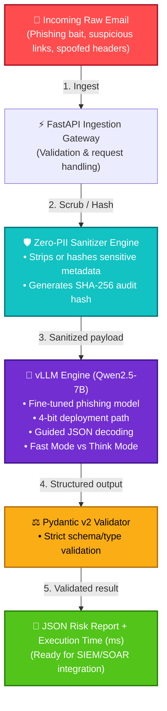

# 🛡️ Zero-PII Phishing Risk Scoring Platform

<p align="center">
  
</p>

<p align="center">
  <a href="https://huggingface.co/Ilieg/qwen2.5-7b-phishing-standard-merged-16bit">
    
  </a>
  <a href="./LICENSE">
    
  </a>
  
  
  
</p>

## Table of Contents

- [Overview](#overview)
- [Why This Project Exists](#why-this-project-exists)
- [Key Results](#key-results)
- [Training & Evaluation Data](#training--evaluation-data)
- [System Architecture](#system-architecture)
- [Core Features](#core-features)
- [Model Evaluation & Ablation Study](#model-evaluation--ablation-study)
- [Research & Design Commentary](#research--design-commentary)
- [Mathematical Foundations](#mathematical-foundations)
- [Reproducing Benchmarks](#reproducing-benchmarks)
- [Public vs Private Components](#public-vs-private-components)
- [Technologies](#technologies)
- [Skills Demonstrated](#skills-demonstrated)
- [Key Learnings](#key-learnings)
- [Internship & Collaboration](#internship--collaboration)
- [License](#license)

---

## Overview

**Zero-PII Phishing Risk Scoring Platform** is a privacy-preserving AI security system designed to analyze phishing threats while preventing sensitive information from ever reaching the inference layer.

The system combines:

- Artificial Intelligence
- Cybersecurity
- Privacy Engineering
- Backend Engineering

to produce structured phishing risk assessments that can integrate with enterprise security workflows (SIEM/SOAR).

---

## Why This Project Exists

Most phishing detection systems focus on detection accuracy alone. This project explores a different engineering question:

> How can an AI system identify phishing threats while minimizing exposure of sensitive user information?

The resulting architecture implements, before a security verdict is returned:

1. Zero-PII preprocessing
2. Structured AI outputs
3. Deterministic validation
4. High-throughput serving
5. Privacy-first logging

---

## Key Results

- Improved phishing classification accuracy from **82.40% → 97.80%**
- Increased phishing F1-score from **80.10% → 97.46%**
- Reduced serving memory requirements from **14.2 GB → 5.9 GB** through 4-bit quantization
- Maintained average inference latency at approximately **255 ms** in the 256-token benchmark
- Achieved deterministic, schema-compliant JSON outputs for downstream integration

> **Metric note:** the reported 97.80% figure is **accuracy**. The corresponding phishing F1-score is **97.46%**, and ROC-AUC is **0.9773**.

---

## Training & Evaluation Data

### Training dataset

The fine-tuning notebook runs in a Kaggle environment and loads the `train` split of:

[`puyang2025/seven-phishing-email-datasets`](https://huggingface.co/datasets/puyang2025/seven-phishing-email-datasets)

The dataset contains approximately **203k examples** in the available training corpus.

The training code loads the split directly:

```python
dataset = load_dataset(
    "puyang2025/seven-phishing-email-datasets",
    split="train"
)
```

Each example is converted into a ChatML conversation of the form:

```text
User:
Classify this email as 'Phishing' or 'Benign'.

Subject: ...
Email Body:
...

Assistant:
Phishing
```

The resulting conversations are tokenized with a maximum sequence length of **2048 tokens** before being passed to the QLoRA training pipeline.

### Evaluation dataset

Model evaluation is performed against a separate **held-out test split**, using the first **500 unseen examples**:

```python
val = load_dataset(
    "puyang2025/seven-phishing-email-datasets",
    split="test"
)

val = val.select(range(min(500, len(val))))
```

This evaluation set is kept separate from the training data used by the notebook.

### Data processing

The training pipeline performs:

- ChatML formatting
- Tokenization
- Sequence truncation to 2048 tokens
- Batched collation with dynamic padding
- Label creation for causal language-model training

The training notebook does **not** reduce the loaded training split to 3,999 examples; it trains from the dataset's `train` split.

---

## System Architecture



### Model / optimization path

```text
Public phishing-email corpus
            │
            ▼
     ChatML formatting
            │
            ▼
      Tokenization
            │
            ▼
      Qwen2.5-7B-Instruct
            │
            ▼
     QLoRA fine-tuning
       ┌────┴────┐
       │         │
    4-bit      LoRA
   base        adapters
  weights     trainable
       │         │
       └────┬────┘
            ▼
       Fine-tuned model
            │
            ▼
     Merge to 16-bit
            │
            ▼
     4-bit AWQ serving
            │
            ▼
          vLLM
            │
            ▼
    GPU / constrained hardware
```

---

## Core Features

### Zero-PII Processing

- SHA-256 hashing of sensitive metadata
- Header sanitization before inference
- Privacy-preserving audit logging

### Threat Classification

- Fine-tuned Qwen2.5-7B model
- QLoRA-based adaptation
- Email phishing risk assessment
- Social engineering detection

### Production-Oriented Serving

- FastAPI REST interface
- Containerized deployment
- vLLM inference engine
- CPU fallback strategy

### Reliability Controls

- Pydantic v2 validation
- Structured JSON outputs
- Contract-first API design
- Input validation boundaries

---

## Model Evaluation & Ablation Study

The ablation study compares two LoRA adapter configurations under the same training budget and evaluation procedure:

| Architecture / Variant | Tuned Target Modules | Accuracy | Phishing F1 | ROC-AUC | Avg. Latency (256 tok) | VRAM Footprint |
|---|---|---:|---:|---:|---:|---:|
| Qwen2.5-7B (Base, Zero-Shot) | None | 82.40% | 80.10% | 0.8310 | ~240 ms | 14.2 GB (16-bit) |
| Standard LoRA (Attention-Only) | `q, k, v, o` | 97.00% | 96.50% | 0.9681 | ~250 ms | 5.8 GB (4-bit AWQ) |
| **Comprehensive LoRA** | `q, k, v, o, gate, up, down` | **97.80%** | **97.46%** | **0.9773** | **~255 ms** | **5.9 GB (4-bit AWQ)** |

The reported fine-tuned-model evaluation uses **500 unseen test examples**.

```text
========================================================================================
                      ROC-AUC SCORE COMPARISON (HIGHER IS BETTER)
========================================================================================

 Qwen2.5-7B (Base Zero-Shot)     ██████████████████████████████████████░░░░░░░  0.8310
 Standard LoRA (q, k, v, o)      █████████████████████████████████████████████  0.9681
 Comprehensive LoRA (All Linear) ██████████████████████████████████████████████ 0.9773

========================================================================================
                      PHISHING F1-SCORE COMPARISON (HIGHER IS BETTER)
========================================================================================

 Qwen2.5-7B (Base Zero-Shot)     ████████████████████████████████████░░░░░░░░░  80.10%
 Standard LoRA (q, k, v, o)      █████████████████████████████████████████████  96.50%
 Comprehensive LoRA (All Linear) ██████████████████████████████████████████████ 97.46%
```

### Ablation finding

Expanding LoRA training beyond attention projections into the MLP projections (`gate_proj`, `up_proj`, `down_proj`) improved the measured phishing F1-score from **96.50% to 97.46%** while increasing reported average latency by about **5 ms** and reported VRAM footprint by about **0.1 GB** in the 4-bit serving benchmark.

The project uses this comparison to investigate whether adapting a broader set of linear projections helps the model learn the phishing-specific task beyond the behavior captured by attention-only adapters.

---

## Research & Design Commentary

### Contract-first AI infrastructure

The system was designed **contract-first**: API contracts, automated tests, and input boundaries were established before the model was integrated into the production path.

| Dimension | Naive ML Approach | This Project's Approach |
|---|---|---|
| Schema Validation | Parses model text with raw `json.loads()` | Strict Pydantic v2 schema combined with vLLM guided decoding |
| Failure Handling | Parsing failures surface as unhandled errors | Output structure is constrained during generation and validated afterward |
| DoS Defense | Accepts unbounded input directly into model context | Enforces an input-length boundary at the API layer |
| Observability | Logs raw confidential email content | Uses SHA-256 hashes for traceable, privacy-preserving logging |

### Guided decoding

LLMs are probabilistic text generators. Even a fine-tuned model can occasionally produce malformed JSON.

vLLM guided decoding constrains token generation according to the expected output grammar/schema, while Pydantic validates the resulting object after generation.

The two stages serve different purposes:

```text
Model generation
      │
      ▼
Guided decoding
      │
      ▼
Structurally constrained JSON
      │
      ▼
Pydantic validation
      │
      ▼
Typed application object
```

### Data engineering

The training notebook loads the `train` split from `puyang2025/seven-phishing-email-datasets`, formats `subject`, `text`, and `label` into ChatML, and tokenizes the resulting conversations.

The evaluation code uses a separate `test` split and evaluates the first 500 examples as an unseen test set.

This separation is important because model performance should be measured on data that was not used to update the model parameters.

### Classical baseline

Before interpreting the LLM results, the project established a classical baseline:

- Accuracy: **91.25%**
- Phishing F1-score: **0.91**

The baseline provides a reference point for evaluating whether the LLM-based approach adds value relative to a simpler model.

### Compute-constrained fine-tuning

The fine-tuning pipeline uses **Unsloth** and **QLoRA** on a constrained GPU environment.

The base Qwen2.5-7B-Instruct model is loaded in **4-bit NF4** form. The base weights remain frozen while LoRA adapters are trained.

Two adapter configurations are compared:

```text
Standard LoRA
├── q_proj
├── k_proj
├── v_proj
└── o_proj

Comprehensive LoRA
├── q_proj
├── k_proj
├── v_proj
├── o_proj
├── gate_proj
├── up_proj
└── down_proj
```

Both configurations use:

- `r = 16`
- `lora_alpha = 16`
- `lora_dropout = 0`
- maximum sequence length: `2048`
- maximum training steps: `300`
- per-device batch size: `2`
- gradient accumulation steps: `4`
- learning rate: `2e-4`
- 8-bit AdamW optimizer
- Unsloth gradient checkpointing

### High-throughput serving

The production serving path uses vLLM.

Key inference-system concepts include:

- **PagedAttention** for efficient KV-cache memory management
- **Continuous batching** for better utilization under concurrent requests
- Quantized weights for reduced memory footprint
- Guided decoding for structured outputs

### Why Qwen2.5-7B?

The project selected Qwen2.5-7B-Instruct as a practical model size for the available compute budget.

The design goal was to retain useful language-model capability while keeping fine-tuning and deployment feasible on constrained GPU hardware.

---

## Mathematical Foundations

### Scaled dot-product attention

$$
\text{Attention}(Q,K,V)
=
\text{softmax}
\left(
\frac{QK^T}{\sqrt{d_k}}
\right)V
$$

### LoRA

$$
W = W_0 + \Delta W
  = W_0 + \frac{\alpha}{r}(B \cdot A)
$$

### Cross-entropy loss

$$
\mathcal{L}_{CE}
=
-\frac{1}{N}
\sum_{i=1}^{N}
\sum_{j=1}^{C}
y_{i,j}\log(\hat{y}_{i,j})
$$

### F1 score

$$
F_1 =
2 \cdot
\frac{\text{Precision}\cdot\text{Recall}}
{\text{Precision}+\text{Recall}}
$$

---

## Reproducing Benchmarks

```bash
# Clone
git clone https://github.com/Ilieg02/Zero-PII-Phishing-Engine-Architecture.git
cd Zero-PII-Phishing-Engine-Architecture

# Install dependencies
python3.10 -m venv .venv
source .venv/bin/activate
pip install -r requirements.txt

# Run the benchmark
python eval_benchmark.py
```

---

## Public vs Private Components

This repository documents the system's design, methodology, evaluation framework, and results. The production application itself lives in a private implementation repository.

### Public

- ✅ Architecture documentation
- ✅ API contracts
- ✅ Evaluation framework
- ✅ Benchmarking methodology
- ✅ Design decisions

### Private

- 🔒 Production API service
- 🔒 Deployment infrastructure
- 🔒 Internal security controls
- 🔒 Operational configurations
- 🔒 Testing environment

---

## Technologies

### AI & Machine Learning

Qwen2.5-7B · QLoRA · PEFT · Hugging Face · Unsloth · vLLM · PyTorch

### Backend Engineering

Python · FastAPI · Pydantic · REST APIs

### Infrastructure

Docker · Linux · Git · GitHub · Kaggle

### Security

Threat Modeling · Privacy Engineering · Data Sanitization · SHA-256 Hashing

---

## Skills Demonstrated

Software Engineering · Artificial Intelligence · Machine Learning · Cybersecurity · Python · FastAPI · Docker · REST APIs · Pydantic · MLOps · LLM Fine-Tuning · Privacy Engineering · System Design · Threat Modeling · Inference Optimization

---

## Key Learnings

This project provided hands-on experience in:

- End-to-end AI system development
- Dataset engineering
- LLM fine-tuning
- Parameter-efficient fine-tuning
- Quantized model deployment
- Model evaluation
- Inference optimization
- Backend API development
- Containerization
- Security-focused architecture
- Privacy-preserving design
- Performance tradeoff analysis

---

## Internship & Collaboration

I'm currently seeking opportunities in:

- Software Engineering
- AI Engineering
- Machine Learning Engineering
- Cybersecurity Engineering

If you're a recruiter, engineer, or researcher interested in AI systems, security infrastructure, inference optimization, or privacy-preserving technology, feel free to connect.

**Built by Ilie Gabuja**

*Privacy First. Security Always. Engineering Over Hype.*

---

## License

Distributed under the **Apache-2.0 License**. See [`LICENSE`](LICENSE) for details.
