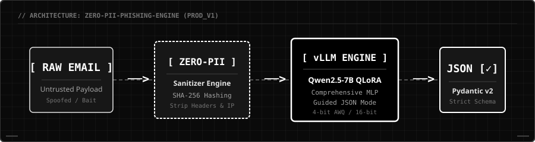

# 🛡️ Zero-PII Phishing Risk Scoring Platform

<p align="center">
  
</p>

<p align="center">
  <a href="https://huggingface.co/Ilieg/qwen2.5-7b-phishing-standard-merged-16bit">
    
  </a>
  <a href="./LICENSE">
    
  </a>
  
  
  
</p>
---

## Overview

Zero-PII Phishing Risk Scoring Platform is a privacy-preserving AI security system designed to analyse phishing threats while preventing sensitive information from reaching the inference layer.

The system combines:

- Artificial Intelligence
- Cybersecurity
- Privacy Engineering
- Backend Engineering

to provide structured phishing risk assessments that can integrate with enterprise security workflows.

---

## Why This Project Exists

Most phishing detection systems focus on detection accuracy alone.

This project explores a different engineering question:

> How can AI systems identify phishing threats while minimising exposure of sensitive user information?

The resulting architecture implements:

- Zero-PII pre processing
- Structured AI outputs
- Deterministic validation
- High-throughput serving
- Privacy-first logging

before security verdicts are returned.

---

## Core Features

### Zero-PII Processing

- SHA-256 hashing of sensitive metadata
- Header sanitisation before inference
- Privacy-preserving audit logging

### Threat Classification

- Fine-tuned Qwen2.5-7B model
- QLoRA-based adaptation
- Email phishing risk assessment
- Social engineering detection

### Production-Oriented Serving

- FastAPI REST interface
- Containerised deployment
- vLLM inference engine
- CPU fallback strategy

### Reliability Controls

- Pydantic v2 validation
- Structured JSON outputs
- Contract-first API design
- Input validation boundaries

---

## System Architecture

Incoming Email

↓

FastAPI Gateway

↓

Zero-PII Sanitisation Layer

↓

Qwen2.5-7B Model (vLLM)

↓

Structured Response Validation

↓

Risk Scoring Output

The private implementation repository contains the production application, testing infrastructure, deployment configuration and internal security controls.

This public repository documents:

- System design
- Evaluation methodology
- API contracts
- Benchmark framework
- Architectural decisions

---

## Technologies

### AI & Machine Learning

- Qwen2.5-7B
- QLoRA
- PEFT
- Hugging Face
- Unsloth
- vLLM

### Backend Engineering

- Python
- FastAPI
- Pydantic
- REST APIs

### Infrastructure

- Docker
- Linux
- Git
- GitHub

### Security

- Threat Modelling
- Privacy Engineering
- Data Sanitisation
- SHA-256 Hashing

---

## Engineering Challenges Solved

### Privacy

Sensitive email data is sanitised before it reaches the model.

### Reliability

All model outputs must satisfy strict schema validation.

### Performance

Quantised deployment reduces VRAM requirements while maintaining performance.

### Security

Input validation and structured contracts reduce attack surface.

---

## Evaluation Results

| Model | Accuracy | F1 Score | ROC-AUC |
|---------|---------|---------|---------|
| Base Qwen2.5-7B | 82.40% | 80.10% | 0.8310 |
| Standard LoRA | 97.00% | 96.50% | 0.9681 |
| Comprehensive QLoRA | 97.80% | 97.46% | 0.9773 |

### Key Finding

Expanding LoRA training beyond attention layers into MLP projections improved phishing F1 performance while introducing minimal latency overhead.

---

## Skills Demonstrated

- Software Engineering
- Artificial Intelligence
- Machine Learning
- Cybersecurity
- Python
- FastAPI
- Docker
- REST APIs
- Pydantic
- MLOps
- LLM Fine-Tuning
- Privacy Engineering
- System Design
- Threat Modelling

---

## Key Learnings

This project provided hands-on experience in:

- End-to-end AI system development
- Dataset engineering
- LLM fine-tuning
- Model evaluation
- Backend API development
- Containerisation
- Security-focused architecture
- Privacy-preserving design

---

## Reproducing Benchmarks

### Clone

```bash
git clone https://github.com/ilieg02/Zero-PII-Phishing-Engine-Architecture.git
cd Zero-PII-Phishing-Engine-Architecture

Install Dependencies
```bash
python3.10 -m venv .venv
source .venv/bin/activate
 
```bash
pip install -r requirements.txt
```bash
python eval_benchmark.py


Public vs Private Components
Public

✅ Architecture Documentation

✅ API Contracts

✅ Evaluation Framework

✅ Benchmarking Methodology

✅ Design Decisions

Private

🔒 Production API Service

🔒 Deployment Infrastructure

🔒 Internal Security Controls

🔒 Operational Configurations

🔒 Testing Environment

## Internship & Collaboration

I'm currently seeking opportunities in:

Software Engineering
AI Engineering
Machine Learning Engineering
Cybersecurity Engineering

- If you're a recruiter, engineer or researcher interested in AI systems, security infrastructure or privacy-preserving technology, feel free to connect.

Built by Ilie Gabuja

Privacy First. Security Always. Engineering Over Hype.
