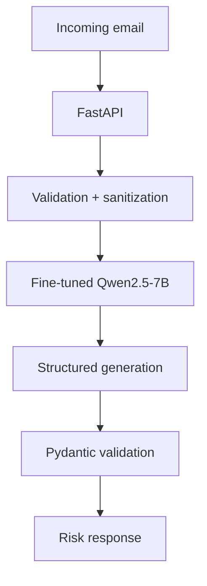

# 🛡️ Zero-PII Phishing Risk Scoring Platform

<p align="center">
  
</p>

<p align="center">
  <a href="https://huggingface.co/Ilieg/qwen2.5-7b-phishing-standard-merged-16bit">
    
  </a>
  <a href="./LICENSE">
    
  </a>
  
  
  
</p>

## What this project is

I built this as an end-to-end experiment in using a fine-tuned LLM for phishing-email classification and then putting that model behind a real API.

The basic flow is:

```text
Email request
    ↓
FastAPI validation
    ↓
Sanitization / hashing of selected metadata
    ↓
Fine-tuned Qwen2.5-7B-Instruct
    ↓
Structured output
    ↓
Pydantic validation
    ↓
Phishing-risk response
```

The interesting part for me was not just getting a good model score. I wanted to understand what happens when the model becomes part of a software system: memory usage, quantization, validation, latency, and failure handling all matter too.

> **Note:** “Zero-PII” is the project's design goal for the inference boundary, not a claim that arbitrary email text can never contain personal information.

## Stack

**Model / training**
- Qwen2.5-7B-Instruct
- PyTorch, Unsloth, LoRA / QLoRA
- 4-bit NF4 base model during fine-tuning
- 2048-token context
- 300 training steps
- Per-device batch size 2
- Gradient accumulation 4
- Learning rate `2e-4`
- 8-bit AdamW
- Gradient checkpointing

**Serving / API**
- FastAPI
- vLLM
- 4-bit AWQ deployment path
- Guided / structured generation
- Pydantic v2
- Docker
- CPU fallback for local development/testing

One distinction worth making clear:

```text
QLoRA → training efficiency
AWQ   → inference/deployment quantization
```

They are used for different parts of the project.

## Data and evaluation

The training notebook runs in a hosted notebook environment and loads the Hugging Face dataset directly:

[`puyang2025/seven-phishing-email-datasets`](https://huggingface.co/datasets/puyang2025/seven-phishing-email-datasets)

The dataset page shows roughly **203k examples**, and the notebook loads the full `train` split:

```python
from datasets import load_dataset

dataset = load_dataset(
    "puyang2025/seven-phishing-email-datasets",
    split="train"
)
```

The final training code does **not** reduce this to 3,999 rows. The older 3,999 figure in an earlier README was incorrect and has been removed.

The emails are formatted into a simple instruction/chat format and tokenized with a maximum sequence length of 2048.

For evaluation, the notebook loads the separate `test` split and evaluates the first **500 examples**:

```python
val = load_dataset(
    "puyang2025/seven-phishing-email-datasets",
    split="test"
)
val = val.select(range(min(500, len(val))))
```

So the reported ML metrics below are based on **N = 500** test examples. This is a project benchmark, not a claim about every real-world phishing dataset.

## Model training

I used QLoRA because full fine-tuning a 7B model is much more expensive in GPU memory. The base model stays frozen and the smaller LoRA adapters are trained on top:

```text
              Qwen2.5-7B
          frozen 4-bit base
                  │
                  ▼
          trainable LoRA layers
                  │
                  ▼
              loss + grads
```

The notebook uses `r=16` and `lora_alpha=16`.

Two adapter configurations were tested:

```text
Standard:
q_proj, k_proj, v_proj, o_proj

Comprehensive:
q_proj, k_proj, v_proj, o_proj,
gate_proj, up_proj, down_proj
```

After training, the model was merged to a 16-bit representation for publication, while the serving benchmark used a 4-bit AWQ deployment path.

## Results

These are the recorded results from the project benchmark on the first 500 examples of the test split:

| Variant | Accuracy | Phishing F1 | ROC-AUC | Avg. latency | Reported VRAM |
|---|---:|---:|---:|---:|---:|
| Qwen2.5-7B base, zero-shot | 82.40% | 80.10% | 0.8310 | ~240 ms | 14.2 GB (16-bit) |
| Standard LoRA | 97.00% | 96.50% | 0.9681 | ~250 ms | 5.8 GB (4-bit AWQ) |
| Comprehensive LoRA | 97.80% | 97.46% | 0.9773 | ~255 ms | 5.9 GB (4-bit AWQ) |

The broader LoRA configuration improved phishing F1 from **96.50% to 97.46%** on this benchmark. The reported latency and VRAM changed only slightly.

I would treat these as measured results from this experiment rather than universal numbers. A larger or independently sampled evaluation set could give different results.

### About the memory numbers

A useful rough calculation is:

```text
7B parameters × 2 bytes ≈ 14 GB   (16-bit weights)
7B parameters × 0.5 bytes ≈ 3.5 GB (4-bit weights)
```

Real GPU usage is higher than the raw weight size because the runtime also needs memory for things like the KV cache, temporary buffers, and framework/runtime state. That is why the reported 4-bit footprint is not exactly one quarter of the 16-bit number.

## Inference architecture



The API is deliberately separate from the model. That made it easier to test the application layer without assuming the model will always behave perfectly.

## API example

Example request:

```bash
curl -X POST http://localhost:8080/api/v1/analyze \
  -H "Content-Type: application/json" \
  -d '{
    "email_text": "URGENT: Your account has been compromised. Verify immediately.",
    "mode": "fast"
  }'
```

Representative response shape:

```json
{
  "status": "success",
  "mode_used": "fast",
  "safe_log_hash": "<sha256-hash>",
  "analysis": {
    "risk_score": 0.98,
    "risk_level": "high",
    "classification": "phishing",
    "signals": [
      "Artificial urgency tactics",
      "Suspicious verification request"
    ],
    "recommended_action": "Do not click links. Report to security team."
  }
}
```

The exact score, hash, and latency depend on the input and runtime, so the values above are illustrative rather than hardcoded output from the service.

## Validation and privacy

The model is still a probabilistic generator, so I did not want the API to trust raw model output.

The application uses:

```text
HTTP request
    ↓
Pydantic validation
    ↓
Sanitization / SHA-256 hashing of selected metadata
    ↓
Model inference
    ↓
Structured decoding
    ↓
Pydantic validation
    ↓
Application response
```

This is a small but important engineering boundary: model output has to become valid application data before it is returned.

## Why vLLM and AWQ?

The project has two separate inference concerns.

**AWQ** reduces the weight precision for the deployment model, helping reduce memory use.

**vLLM** is used as the serving runtime, where concerns such as KV-cache management, batching, and repeated generation requests become important.

That separation mirrors the way I think about the system:

```text
Model weights → quantization
Runtime       → serving / scheduling
API           → validation / application logic
```

## Reproducing the benchmark

The main training notebook is under `notebooks/`.

Key settings:

```python
MAX_SEQ_LENGTH = 2048
TRAIN_MAX_STEPS = 300
BATCH_SIZE_PER_DEVICE = 2
GRAD_ACCUM_STEPS = 4
LEARNING_RATE = 2e-4
SEED = 3407
```

The evaluation code loads the `test` split and uses the first 500 examples. The repository also includes `eval_benchmark.py` for the application benchmark.

Exact latency and VRAM can vary with GPU model, drivers, CUDA/runtime versions, batch size, concurrency, and other environment details. The numbers in this README should therefore be read as the **recorded project measurements**.

## Repository structure

```text
.
├── app/
│   ├── llm_service.py
│   ├── main.py
│   ├── schemas.py
│   ├── security.py
│   └── settings.py
├── docs/
│   └── banner-bw.svg
├── notebooks/
│   └── qwen2_5_7b_qlora.ipynb
├── scripts/
│   └── test_api.py
├── tests/
│   ├── test_analyze.py
│   ├── test_health.py
│   └── test_validation.py
├── Dockerfile
├── docker-compose.yml
├── pytest.ini
├── README.md
└── requirements.txt
```

## What I learned

The biggest lesson from the project was that model performance and software performance are different problems.

I learned how to:

- fine-tune a 7B model without updating every parameter
- reason about GPU memory and quantization
- separate training optimization from inference optimization
- build an API around a generative model instead of trusting raw output
- benchmark accuracy alongside latency and memory
- be careful about what a benchmark actually proves

The project also made the hardware side of ML much more concrete. Once a model is large enough, things like precision, memory movement, batching, and runtime behavior stop being implementation details and become part of the actual engineering problem.

## Limitations / next steps

This is still a project benchmark rather than a production security product. The next improvements I would make are:

- test on a larger external dataset
- publish a full confusion matrix and class balance
- check probability/risk-score calibration
- benchmark controlled concurrency and throughput
- reproduce the serving path on additional hardware, including an NPU target
- make the training and evaluation pipeline easier for another person to reproduce exactly

## Technologies

**AI / ML:** PyTorch · Qwen2.5-7B-Instruct · QLoRA · LoRA · Unsloth · Hugging Face  
**Inference:** vLLM · AWQ · guided / structured decoding  
**Backend:** Python · FastAPI · Pydantic v2 · REST APIs  
**Systems:** Linux · Docker · Git · hosted notebook environment  
**Security:** sanitization · SHA-256 hashing · input/output validation

## License

Distributed under the **Apache-2.0 License**. See [`LICENSE`](LICENSE).

## Author

**Ilie Gabuja**

I built this project to learn what it actually takes to move an LLM from a training notebook into a working software system — not just the model itself, but the memory limits, inference tradeoffs, API boundaries, and practical engineering around it.

[Published model on Hugging Face](https://huggingface.co/Ilieg/qwen2.5-7b-phishing-standard-merged-16bit)  
[Training dataset on Hugging Face](https://huggingface.co/datasets/puyang2025/seven-phishing-email-datasets)
