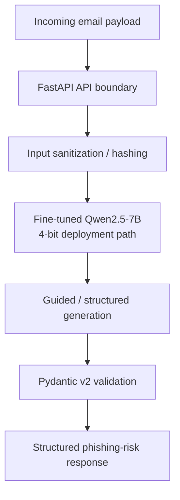

# 🛡️ Zero-PII Phishing Risk Scoring Platform

<p align="center">
  
</p>

<p align="center">
  <a href="https://huggingface.co/Ilieg/qwen2.5-7b-phishing-standard-merged-16bit">
    
  </a>
  <a href="./LICENSE">
    
  </a>
  
  
  
</p>

## Overview

I built this project as an end-to-end experiment in **LLM-based phishing detection**, with a strong focus on the parts that matter when a model has to live inside a real software system: data handling, validation, inference cost, and predictable outputs.

The system takes an email payload, sanitizes selected sensitive metadata before model inference, runs a fine-tuned **Qwen2.5-7B-Instruct** model, and returns a structured phishing-risk result through a **FastAPI** service.

The project brings together four areas:

- machine learning and LLM fine-tuning
- inference optimization and quantization
- backend/API engineering
- privacy and security controls

The goal was not to claim that an LLM can replace every phishing-detection system. The goal was to build and measure a complete pipeline and understand the tradeoffs between **accuracy, memory, latency, and engineering reliability**.

> **Naming note:** “Zero-PII” describes the project's design goal for the inference boundary. It should not be read as a claim that arbitrary email text can never contain personal information.

---

## Why I Built It

A model can have good classification metrics and still be awkward to use in an application.

For an email-security service, I also need to think about questions like:

- What reaches the model?
- What happens when the input is malformed?
- What happens when the model returns invalid structured data?
- How much GPU memory does the model need?
- Does quantization change the result?
- Can the inference layer fit inside the available hardware budget?

That led to the architecture below:

```text
Incoming email
      │
      ▼
 FastAPI boundary
      │
      ├── input validation
      ├── length checks
      └── metadata sanitization / hashing
      │
      ▼
 Fine-tuned Qwen2.5-7B
      │
      ├── 4-bit deployment path
      └── structured generation
      │
      ▼
 Pydantic validation
      │
      ▼
 Structured phishing-risk response
```

The important part is that the model is one component of the system, not the whole system.

---

## What the Project Actually Uses

### Model and training

- **Base model:** `Qwen2.5-7B-Instruct`
- **Training stack:** PyTorch, Unsloth, QLoRA/LoRA
- **Training representation:** 4-bit NF4 base model with frozen base weights and trainable LoRA adapters
- **Context length:** 2048 tokens
- **Training budget in the notebook:** 300 steps
- **Per-device batch size:** 2
- **Gradient accumulation:** 4
- **Learning rate:** `2e-4`
- **Optimizer:** 8-bit AdamW
- **Gradient checkpointing:** enabled

The logged T4 training run did not have BF16 support available, so the trainer used the FP16 path.

### Serving

- **FastAPI** for the HTTP API
- **vLLM** for LLM inference
- **4-bit AWQ** serving path for the quantized model
- **Guided/structured decoding** for JSON-shaped model output
- **Pydantic v2** for application-level validation
- **Docker** for the containerized deployment path
- **CPU fallback code path** for local development/testing when GPU inference is unavailable

A useful distinction in this project is:

```text
QLoRA  →  used to fine-tune the model efficiently
AWQ    →  used in the 4-bit inference/deployment path
```

They solve different problems.

---

## Training & Evaluation Data

The training notebook runs in a hosted notebook environment and loads the **Hugging Face** dataset directly:

[`puyang2025/seven-phishing-email-datasets`](https://huggingface.co/datasets/puyang2025/seven-phishing-email-datasets)

The current dataset page reports roughly **203k examples** in the dataset, and the notebook uses the `train` split directly:

```python
from datasets import load_dataset

dataset = load_dataset(
    "puyang2025/seven-phishing-email-datasets",
    split="train"
)
```

There is **no `select(...)` call reducing the training data to 3,999 rows** in the training code used for the final fine-tuning run. The older 3,999-row description that appeared in an earlier version of this README was therefore removed.

### Formatting

The notebook converts each email into a simple chat-style instruction:

```text
User:
Classify this email as 'Phishing' or 'Benign'.

Subject: ...
Email Body:
...

Assistant:
Phishing
```

The resulting conversations are tokenized with a maximum sequence length of **2048 tokens**.

### Evaluation

The evaluation code loads the dataset's separate `test` split and takes the first **500 examples**:

```python
val = load_dataset(
    "puyang2025/seven-phishing-email-datasets",
    split="test"
)

val = val.select(range(min(500, len(val))))
```

That gives a fixed **N = 500** benchmark set that is separate from the training split.

> **Important limitation:** this is a project benchmark, not a claim about performance on every real-world phishing dataset. The evaluation uses a fixed slice of the provided test split rather than a newly randomized external test set.

---

## System Architecture



### Model optimization path

```text
Qwen2.5-7B-Instruct
        │
        ▼
   4-bit NF4 base
        │
        ├───────────────┐
        │               │
        ▼               ▼
   Frozen base      LoRA adapters
                        │
                        ▼
                  QLoRA training
                        │
                        ▼
                Fine-tuned weights
                        │
                        ▼
                 16-bit merged model
                        │
                        ▼
                  4-bit AWQ serving
                        │
                        ▼
                       vLLM
```

The important engineering idea is that **training-time quantization and serving-time quantization are separate stages** in this project.

---

## Key Results

The main benchmark reported by the project is based on **500 examples from the test split**.

| Model / variant | Accuracy | Phishing F1 | ROC-AUC | Avg. latency | Reported VRAM |
|---|---:|---:|---:|---:|---:|
| Qwen2.5-7B base, zero-shot | 82.40% | 80.10% | 0.8310 | ~240 ms | 14.2 GB (16-bit) |
| Standard LoRA (`q`, `k`, `v`, `o`) | 97.00% | 96.50% | 0.9681 | ~250 ms | 5.8 GB (4-bit AWQ) |
| Comprehensive LoRA (`q`, `k`, `v`, `o`, `gate`, `up`, `down`) | 97.80% | 97.46% | 0.9773 | ~255 ms | 5.9 GB (4-bit AWQ) |

### What changed in the ablation

The interesting experiment was not simply “fine-tune vs. do not fine-tune.” I also tested whether giving LoRA access to more of the transformer's linear layers changed the result.

```text
Standard LoRA
├── q_proj
├── k_proj
├── v_proj
└── o_proj

Comprehensive LoRA
├── q_proj
├── k_proj
├── v_proj
├── o_proj
├── gate_proj
├── up_proj
└── down_proj
```

On the reported 500-example benchmark, the broader adapter configuration moved phishing F1 from **96.50% to 97.46%**. The reported average latency increased from roughly **250 ms to 255 ms**, and the reported VRAM figure moved from **5.8 GB to 5.9 GB**.

I would treat that as a **measured result from this experiment**, not as proof that comprehensive LoRA is always better. A larger or independently sampled evaluation set could change the conclusion.

### Memory result

The benchmark reports a drop from **14.2 GB for the 16-bit base configuration to 5.9 GB for the 4-bit AWQ deployment configuration**.

That reduction is the practical reason quantization matters here: a 7B-parameter model becomes much easier to run within a limited GPU memory budget.

The exact memory number depends on the measurement setup, so the figures above should be read as **project benchmark measurements**, not universal hardware requirements.

---

## A Note About the Older Results in the Repository

An earlier version of the project documentation also recorded a classical baseline of:

- Accuracy: **91.25%**
- Phishing F1: **0.91**

That baseline came from an earlier project data path (`data/raw/test.jsonl`). I have kept it out of the main comparison table because it is **not automatically apples-to-apples with the final 500-example Hugging Face test benchmark**.

This is intentional: keeping one benchmark table internally consistent is more useful than mixing results from different data pipelines and making the numbers look more comparable than they are.

---

## API Design

The application exposes a FastAPI endpoint for email analysis and validates requests before inference.

Example request:

```bash
curl -X POST http://localhost:8080/api/v1/analyze \
  -H "Content-Type: application/json" \
  -d '{
    "email_text": "URGENT: Your account has been compromised. Verify immediately.",
    "mode": "fast"
  }'
```

The repository also contains examples for a deeper analysis mode and for requests containing headers plus email body content.

The exact response depends on the active inference path and model output, so examples in this README use **illustrative values rather than pretending that a particular hash, risk score, or latency is returned for every request**.

A representative response shape is:

```json
{
  "status": "success",
  "mode_used": "fast",
  "safe_log_hash": "<sha256-hash>",
  "analysis": {
    "risk_score": 0.98,
    "risk_level": "high",
    "classification": "phishing",
    "signals": [
      "Artificial urgency tactics",
      "Suspicious verification request"
    ],
    "recommended_action": "Do not click links. Report to security team."
  }
}
```

### Input validation

One of the lessons from the project was that model quality does not remove the need for normal software engineering.

The API applies input validation at the boundary, and the application uses Pydantic models to enforce the expected request/response shapes.

That means the flow is roughly:

```text
HTTP request
    │
    ▼
Pydantic / perimeter checks
    │
    ▼
Sanitize selected sensitive metadata
    │
    ▼
Model inference
    │
    ▼
Structured decoding
    │
    ▼
Pydantic validation
    │
    ▼
Application response
```

---

## Privacy & Security Design

The security side of the project is deliberately simple and software-engineering focused.

### Sensitive metadata handling

The security layer includes sanitization of selected email metadata and SHA-256 hashing for traceable logging without storing the original value in the audit field.

The design intent is:

```text
Raw request
   │
   ├── sensitive metadata → sanitize / hash
   │
   └── email content      → model input after preprocessing
   │
   ▼
Inference layer
```

### Structured outputs

The model is still a probabilistic generator. That is why the application does not simply call `json.loads()` and hope the output is valid.

Instead, the project uses:

1. guided/structured generation during inference
2. Pydantic validation after generation

The first step constrains the model's output format; the second checks the resulting application object.

### CPU fallback

A CPU fallback path is included for local development and testing when GPU inference is unavailable. It should not be interpreted as a guarantee of production uptime or identical model behavior.

---

## Why QLoRA?

Full fine-tuning updates all of the model's parameters. For a 7B model, that makes the optimizer, gradients, activations, and model weights expensive to store.

QLoRA changes the training problem:

```text
                 Base model
              (frozen, 4-bit)
                    │
                    │ forward pass
                    ▼
              Model activations
                    │
                    ▼
           Trainable LoRA adapters
                 (small update)
                    │
                    ▼
                 Loss / grads
```

The base model stays frozen while the smaller LoRA matrices are trained.

In this project, the notebook uses **rank `r = 16`** and `lora_alpha = 16`.

This made it practical to experiment with a 7B model on constrained hardware instead of trying to perform a full-parameter fine-tune.

---

## Why 4-bit Quantization?

A rough way to think about weight memory is:

```text
7B parameters × bytes per parameter
```

Very roughly:

- 16-bit weights → about 14 GB just for raw weights
- 4-bit weights → about 3.5 GB just for raw weights

Real GPU usage is larger because the runtime also needs memory for things such as the KV cache, temporary buffers, CUDA state, and framework overhead.

That is why the measured deployment footprint is **not** exactly one quarter of the 16-bit measurement.

### QLoRA vs. AWQ in this project

These are easy to mix up, so the project keeps the roles separate:

```text
QLoRA
  → training efficiency
  → 4-bit frozen base + trainable adapters

AWQ
  → inference/deployment optimization
  → 4-bit weight-quantized serving model
```

---

## Why vLLM?

The project uses vLLM for the GPU serving path because the problem is not only “can the model answer?” It is also “can the model answer repeatedly without wasting GPU memory or leaving the hardware mostly idle?”

Relevant inference concepts in the project include:

- KV-cache memory management
- continuous batching
- efficient GPU utilization
- structured/guided decoding
- latency vs. throughput tradeoffs

For this project, the main value of vLLM is that it provides an inference runtime designed around these serving concerns rather than treating generation as a one-off Python function call.

---

## Reproducing the Training/Evaluation Setup

The core training notebook lives under `notebooks/` in the project repository.

The important parts of the training configuration are:

```python
MAX_SEQ_LENGTH = 2048
TRAIN_MAX_STEPS = 300
BATCH_SIZE_PER_DEVICE = 2
GRAD_ACCUM_STEPS = 4
LEARNING_RATE = 2e-4
SEED = 3407
```

The model is loaded with a 4-bit base checkpoint and trained with LoRA adapters.

Standard attention-only adapters target:

```text
q_proj, k_proj, v_proj, o_proj
```

The broader configuration also targets:

```text
gate_proj, up_proj, down_proj
```

For evaluation, the notebook loads the separate `test` split and evaluates the first 500 examples.

For the application benchmark, the repository also contains `eval_benchmark.py`:

```bash
python eval_benchmark.py
```

Exact latency and VRAM numbers can vary with GPU model, drivers, CUDA/runtime versions, quantization settings, batch/concurrency, and other environment details. The values in this README are therefore presented as the **recorded project benchmark**, not guaranteed reproduction numbers for every machine.

---

## Repository Structure

```text
.
├── app/
│   ├── llm_service.py        # vLLM client + CPU fallback path
│   ├── main.py               # API routing and error handling
│   ├── schemas.py            # Pydantic v2 request/response models
│   ├── security.py           # sanitization + SHA-256 audit hashing
│   └── settings.py           # environment configuration
├── docs/
│   └── banner-bw.svg
├── notebooks/
│   └── qwen2_5_7b_qlora.ipynb
├── scripts/
│   └── test_api.py
├── tests/
│   ├── test_analyze.py
│   ├── test_health.py
│   └── test_validation.py
├── Dockerfile
├── docker-compose.yml
├── pytest.ini
├── README.md
└── requirements.txt
```

File names reflect the project structure documented in the repository; local branches may contain additional files.

---

## What I Learned From the Project

The most useful lessons were not individual library names. They were the tradeoffs between layers of the system.

### 1. Model quality is only one part of the problem

A high F1 score does not automatically give you a reliable service. Input validation, output validation, logging, deployment, and failure handling still matter.

### 2. Fine-tuning and inference optimization are different problems

QLoRA helped make training feasible. AWQ helped make the serving footprint smaller. vLLM addressed runtime and batching concerns.

### 3. Memory is a first-class engineering constraint

The 7B model made this obvious. The difference between 16-bit and 4-bit representation changes what hardware can realistically run the model.

### 4. Benchmark methodology matters

A number like “97.8%” only means something when the reader also knows the dataset split, evaluation size, prompt format, and benchmark conditions. That is why the final README states the **500-example test slice** explicitly.

### 5. The model and the system should be evaluated separately

The model can be good while the API is poorly engineered, and the API can be well engineered while the model is inaccurate. Keeping those concerns separate made the project easier to reason about.

---

## Limitations & Next Steps

There are several things I would improve before treating this as a production-grade security product:

- evaluate on a larger, independently sampled external test set
- report class balance and a full confusion matrix
- measure precision/recall separately for the phishing class
- add calibration analysis for risk scores
- benchmark under controlled concurrency rather than relying only on average single-request latency
- validate the serving path on additional hardware, including an NPU target
- make the data preprocessing and benchmark scripts easier for another person to reproduce exactly

These are not missing because the project was “finished”; they are the natural next steps after getting the end-to-end pipeline working.

---

## Technologies

**AI / ML:** PyTorch · Qwen2.5-7B-Instruct · QLoRA · LoRA · Unsloth · Hugging Face

**Inference:** vLLM · AWQ · guided/structured decoding

**Backend:** Python · FastAPI · Pydantic v2 · REST APIs

**Systems / Infrastructure:** Linux · Docker · Git · Kaggle-hosted notebook environment

**Security / Privacy:** input sanitization · SHA-256 hashing · validation boundaries

---

## License

Distributed under the **Apache-2.0 License**. See [`LICENSE`](LICENSE) for details.

---

## Author

**Ilie Gabuja**

Built as a hands-on project to learn how modern LLMs move from a training notebook into an actual software system — including the uncomfortable parts: data quality, memory limits, inference tradeoffs, and validation.

[Published model on Hugging Face](https://huggingface.co/Ilieg/qwen2.5-7b-phishing-standard-merged-16bit)

[Training dataset on Hugging Face](https://huggingface.co/datasets/puyang2025/seven-phishing-email-datasets)
